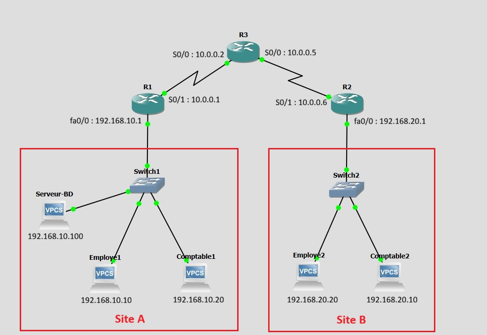
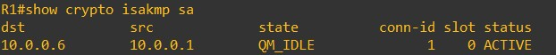
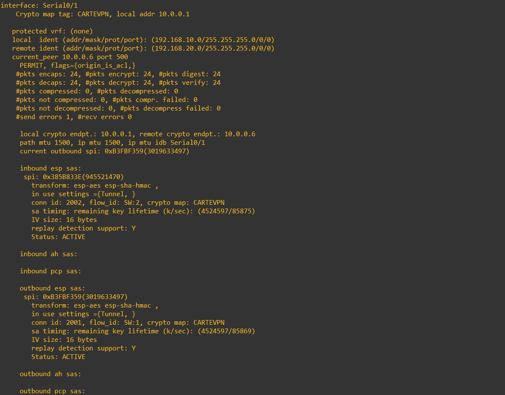
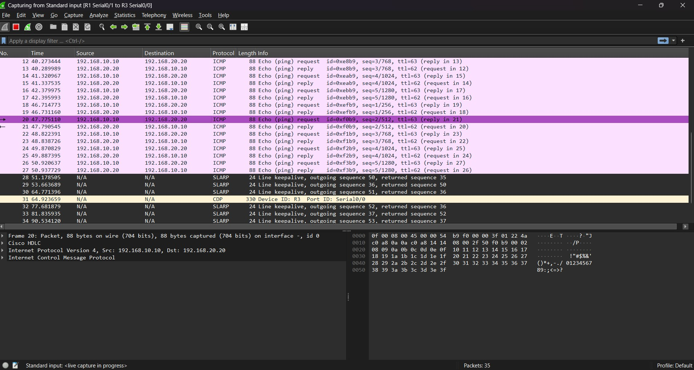
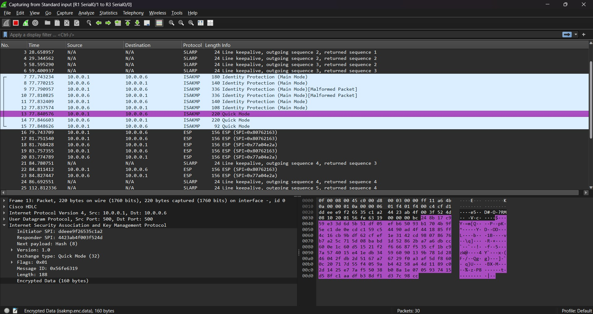

# Secure Site-to-Site IPsec VPN

A GNS3-based network security project implementing a secure site-to-site IPsec VPN between two local networks through an intermediary network.

## Overview

This project was carried out during a summer internship at **Tunisie Télécom** as part of the 3rd-year Engineering program in **Networks and Telecommunications (RT)** at **INSAT**.

The objective was to establish secure communication between two remote LANs using a **site-to-site IPsec VPN tunnel**, while applying access control rules to regulate network access.

The network was designed and tested using **GNS3**, with Cisco 3725 routers and VPCS hosts. **Wireshark** was used to analyze network traffic and verify the encryption of packets crossing the VPN.

## Network Architecture

The topology consists of two remote sites connected through an intermediary router representing the Internet.

* **Site A:** `192.168.10.0/24`
* **Site B:** `192.168.20.0/24`
* **R1:** VPN gateway for Site A
* **R2:** VPN gateway for Site B
* **R3:** Intermediary/Internet router
* The IPsec tunnel is established between **R1 and R2**, through R3.

### Topology



## IP Addressing

### Site A

* R1 LAN interface: `192.168.10.1/24`
* Employe1: `192.168.10.10/24`
* Comptable1: `192.168.10.20/24`
* Server-BD: `192.168.10.100/24`

### Site B

* R2 LAN interface: `192.168.20.1/24`
* Employe2: `192.168.20.20/24`
* Comptable2: `192.168.20.10/24`

### WAN Links

* R1 ↔ R3: `10.0.0.0/30`

  * R1: `10.0.0.1`
  * R3: `10.0.0.2`
* R3 ↔ R2: `10.0.0.4/30`

  * R3: `10.0.0.5`
  * R2: `10.0.0.6`

## Technologies and Tools

* **GNS3** — Network emulation and topology design
* **Cisco IOS** — Router configuration
* **Cisco 3725** — VPN gateway routers
* **VPCS** — Virtual hosts used to test connectivity
* **IPsec / IKE** — VPN and secure communication
* **ACLs** — Traffic access control
* **Wireshark** — Packet capture and traffic analysis
* **LaTeX / Overleaf** — Internship report

## IPsec VPN Configuration

The VPN is configured between R1 and R2.

### Phase 1 — IKE / ISAKMP

The routers use IKE/ISAKMP to establish the security association required before IPsec communication.

The configuration includes:

* AES encryption
* Pre-shared key authentication
* Diffie-Hellman Group 2
* IKE security association lifetime of 86400 seconds


### Phase 2 — IPsec

IPsec protects traffic exchanged between the two LANs.

The configured transform set uses:

* ESP
* AES encryption
* SHA-HMAC integrity

The VPN traffic is identified using extended access lists matching:

```text
192.168.10.0/24 → 192.168.20.0/24
```

and the reverse direction on R2.

The IPsec crypto map is then applied to the WAN interfaces of R1 and R2.

## Access Control

Extended ACLs were also configured to apply different network access policies to the user profiles.

The intended policy is:

* **Employees:** Internet access allowed
* **Accountants:** Internet access restricted
* **Server-BD:** Accessible to authorized hosts

The ACL configuration files are available in the `configs/` directory.

## Verification and Testing

Several tests were performed to verify the VPN configuration and network behavior.

### VPN State

The following Cisco commands were used to verify the VPN:

```text
show crypto isakmp policy
show crypto isakmp sa
show crypto ipsec sa
```

These commands provide information about the IKE policy, Phase 1 security associations, and IPsec security associations.

Example screenshots are available in the `screenshots/` directory.

### IKE / ISAKMP Verification



### IPsec Verification



### Wireshark Analysis

Wireshark was used to observe traffic before and after IPsec protection.

Before encryption, ICMP traffic can be inspected normally.



After the VPN is established, traffic crossing the VPN can be observed as ISAKMP Quick Mode exchanges. The payload is fully encrypted (Encrypted Data: 160 bytes), confirming that the Phase 2 negotiation is secure and the tunnel is being successfully established.



## Repository Structure

```text
site-to-site-ipsec-vpn/
│
├── README.md
│
├── configs/
│   ├── R1-config.txt
│   ├── R2-config.txt
│   └── R3-config.txt
│
├── topology/
│   ├── topology.jpg
│   └── site-to-site-ipsec-vpn.gns3
│
├── Report_FR.pdf
│
└── screenshots/
    ├── show-crypto-isakmp-sa.jpg
    ├── show-crypto-ipsec-sa.jpg
    ├── show-crypto-isakmp-policy.jpg
    ├── wireshark-before-encryption.jpg
    └── wireshark-after-encryption.jpg
```

## Configuration Files

The `configs/` directory contains the router configurations used in the project:

* `R1-config.txt` — Site A VPN gateway
* `R2-config.txt` — Site B VPN gateway
* `R3-config.txt` — Intermediary router

The configurations can be used as a reference for reproducing the topology in GNS3.

## GNS3 Project

The complete GNS3 project file is available in:

```text
topology/site-to-site-ipsec-vpn.gns3
```

A compatible Cisco IOS image for the Cisco 3725 routers is required to run the topology. The IOS image itself is not included in this repository.

## Documentation

The complete internship report, written in French, is available here:

[Internship Report](Report_FR.pdf)

The report contains the detailed methodology, configuration steps, network architecture, testing procedures, and results.

## Project Results

The project successfully demonstrated:

* Configuration of a site-to-site IPsec VPN
* Secure communication between two remote LANs
* IKE/ISAKMP security association establishment
* IPsec security association establishment
* Traffic protection using ESP
* Traffic analysis using Wireshark
* Application of ACL-based access control

## Author

**Nour SMADHI**

Engineering Student
Networks and Telecommunications (RT)
National Institute of Applied Sciences and Technology (INSAT), Tunis, Tunisia

Summer Internship — Tunisie Télécom
June–July 2026
